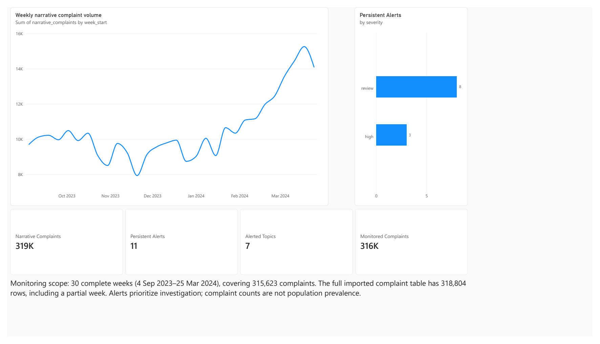
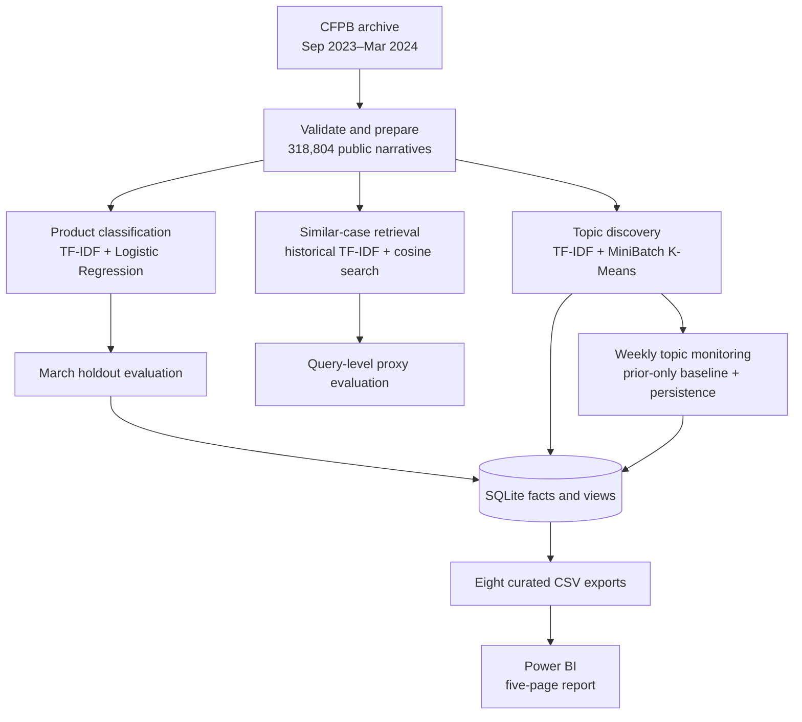
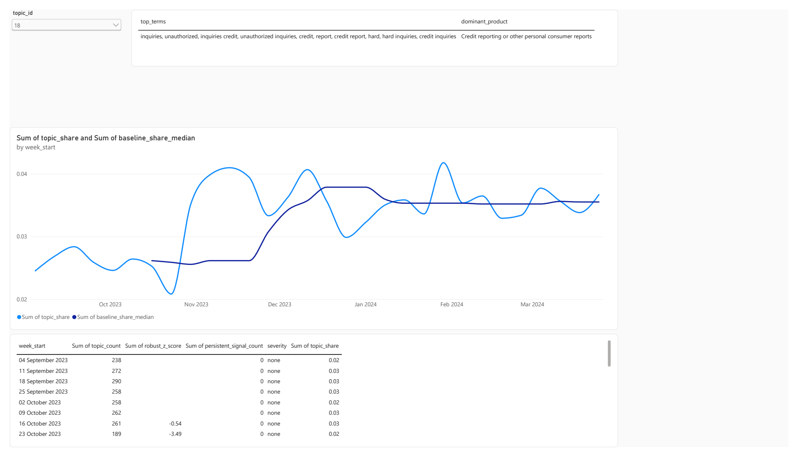
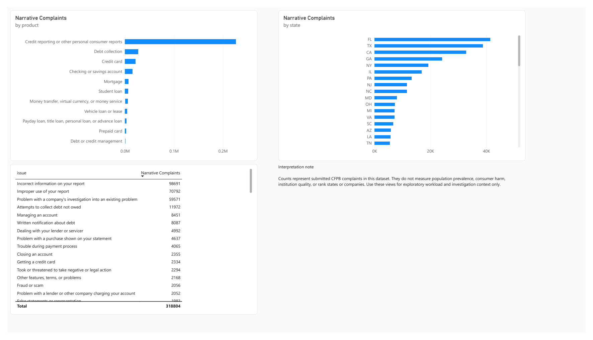
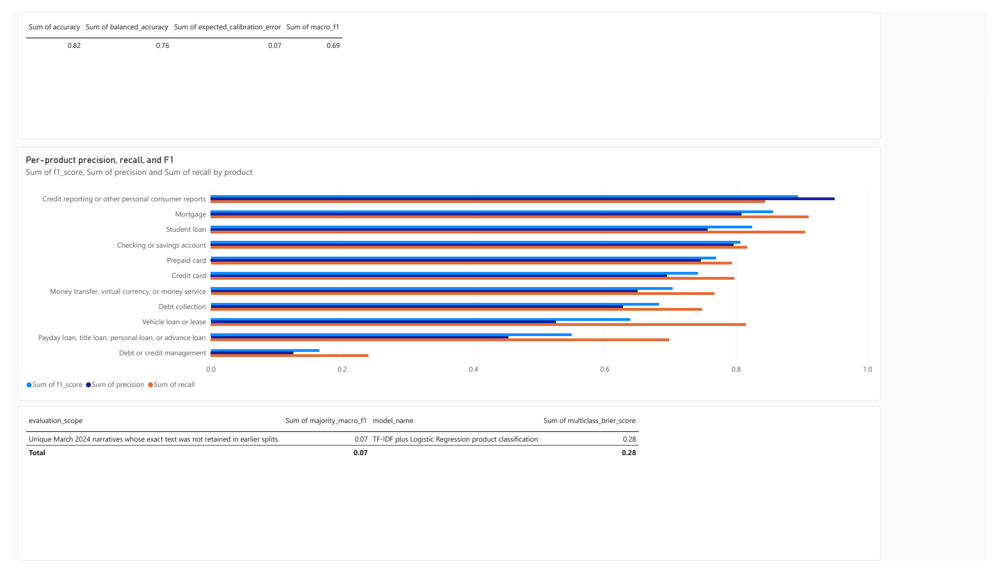

# Financial Complaint Intelligence and Emerging Risk Detection

A local, reproducible NLP pipeline for turning public CFPB complaint narratives into searchable
cases, product predictions, emerging-topic signals, and an analyst-facing Power BI report.

**Python · scikit-learn · Pandas · SQLite/SQL · Power BI · Pytest**

[Explore the Power BI report](powerbi/Financial_Complaint_Intelligence.pbix) ·
[Read the technical notes](notes/README.md) ·
[Prepare for an interview](notes/15_interview_questions.md)



*Complaint Overview from the local five-page Power BI report. The 319K and 316K cards are rounded;
the exact counts are 318,804 imported narratives and 315,623 complaints in complete monitoring
weeks.*

## Why this project exists

Complaint narratives are unstructured and difficult to review at scale. A single complaint may
need classification and related-case context, while a growing theme can be missed when analysts
look only at total volume. This project combines those tasks in a batch workflow and surfaces
weekly changes for human investigation.

## What it delivers

| Capability | Implemented result |
|---|---|
| Product classification | TF-IDF + class-weighted Logistic Regression across 11 CFPB products |
| Similar-case retrieval | Exact cosine search over 177,475 historical narratives; lexical baseline |
| Topic discovery | 30 exploratory TF-IDF + MiniBatch K-Means topics assigned to 318,804 narratives |
| Emerging-signal detection | Prior-only weekly topic-share baseline with volume and persistence rules |
| Analyst reporting | Validated SQLite views, eight curated exports, and a five-page Power BI report |

The system supports investigation. It does not make lending or enforcement decisions, and an alert
does not establish harm, misconduct, or causation.

## Architecture



The pipeline runs locally in batches. The classifier uses a chronological, exact-text-isolated
March 2024 holdout; each weekly alert is scored against earlier weeks only. Retrieval has its own
proxy evaluation and is not presented as a dashboard alert. The reporting layer receives
structured exports, not raw complaint narratives. See the [architecture decisions](notes/02_system_architecture.md)
for data contracts and trade-offs.

## Dataset and results

The fixed [CFPB Consumer Complaint Database](https://www.consumerfinance.gov/data-research/consumer-complaints/)
archive contains **945,532** submitted complaints from September 2023 through March 2024.
**318,804** have a published narrative. The modelling and monitoring population is therefore a
selected subset of submissions.

| Evaluation | Result | Scope |
|---|---:|---|
| Classification accuracy | **0.8242** | 36,871 exact-text-isolated March 2024 test narratives |
| Classification macro F1 | **0.6938** | Equal weight to each of 11 products |
| Balanced accuracy / calibration error | **0.7578 / 0.0660** | Same held-out test set |
| Retrieval precision@5 | **0.5233** | 1,100 balanced queries; product agreement is a proxy for relevance |
| Topic separation | **0.0490** cosine silhouette | Selected 30-topic clustering baseline; substantial overlap remains |
| Emerging signals | **30 candidates → 11 persistent alerts** | 30 complete weeks; 7 distinct alerted topics |

The majority-class reference reached 0.6227 accuracy but only 0.0698 macro F1, illustrating why
accuracy alone is misleading here. The weakest classifier category remains *Debt or credit
management*. Retrieval relevance has not been judged by humans, topics are exploratory, and there
are no verified incident labels from which to calculate alert precision or recall.

## Power BI report

The versioned [PBIX](powerbi/Financial_Complaint_Intelligence.pbix) contains five local Desktop
pages: Complaint Overview, Emerging Risk Alerts, Topic Monitoring, Product & Geography, and Model
Quality. Selecting an alert filters its supporting complaint **metadata** by topic and week. The
report does not import the free-text complaint narrative.

### Topic Monitoring



*Compare an exploratory topic's weekly share with its historical baseline.*

### Product & Geography



*Explore where complaints in this selected dataset are concentrated.*

### Model Quality



*Inspect aggregate and per-product classifier performance before using predictions.*

These are exported views of the local report. There is no Power BI Service deployment or scheduled
refresh. See the [report guide](powerbi/README.md) for the model, measures, source tables, and
refresh checks.

## Reproduce locally

Use Python 3.10 or newer from the repository root:

```powershell
python -m venv .venv
.venv\Scripts\Activate.ps1
python -m pip install -r requirements.txt
python -m pip install -e .
python -m complaint_intelligence
```

The raw archive and generated data are excluded from Git. Start with the
[dataset acquisition guide](notes/04a_dataset_acquisition_plan.md), then run the stages in order:

```powershell
$env:PYTHONPATH = "src"
python -m complaint_intelligence.acquisition --help
python -m complaint_intelligence.inspection --help
python -m complaint_intelligence.preparation
python -m complaint_intelligence.splitting
python -m complaint_intelligence.baseline
python -m complaint_intelligence.evaluation
python -m complaint_intelligence.retrieval
python -m complaint_intelligence.clustering
python -m complaint_intelligence.risk_detection
python -m complaint_intelligence.analytics
```

The acquisition and inspection help commands show the required source and safety options. The
remaining commands produce local artifacts documented in the [numbered notes](notes/README.md).
Run the validation suite with:

```powershell
python -m pytest -q --basetemp .pytest-tmp
python -m ruff check .
```

## Scope and responsible use

- CFPB submissions and published narratives are not representative of all consumers; counts are
  not population prevalence or company-quality rankings.
- Cluster terms may reflect templates or legal language. A human must interpret a topic before
  treating it as a real consumer issue.
- Alert severity ranks statistical investigation priority, not consumer harm. Operational
  escalation requires independent evidence and human review.
- The PBIX contains public complaint IDs and structured metadata, so it is privacy-reduced rather
  than anonymous. Raw narratives, prepared data, model files, and the SQLite database stay out of
  Git.

This repository is a **completed local v1 research prototype**. Dense neural embeddings, human
retrieval judgements, externally labelled alert backtests, an API, automated refresh, and grounded
generated summaries are future extensions. See [limitations and responsible use](notes/14_limitations_and_responsible_ai.md)
for the full boundary.
